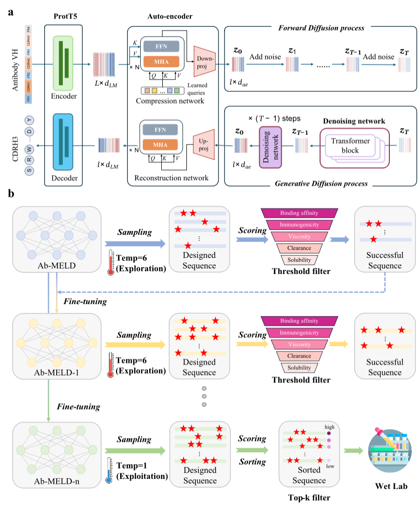

# Ab-MELD: Reshaping the Antibody Manifold via Multi-objective Entropy-regularized Latent Diffusion

This repository provides the official implementation for **Ab-MELD**, a Latent Diffusion model adapted for high-quality antibody sequence generation using protein-specific language models (ProtT5)


---

## Environment Setup

Create the environment using the provided `environment.yml`:

```bash
conda env create -f environment.yml
conda activate ab-meld
```

---

## Usage with JSON Configuration

We support a clean, JSON-based configuration system to manage experiment parameters. You can find example templates in the `configs/` directory.

### 1. Train Language Autoencoder
First, train a high-quality autoencoder to map antibody sequences into a continuous latent space.

```bash
python train_latent_model.py --config configs/config_latent.json
```
**Key parameters in `config_latent.json`:**
- `data_path`: Path to your antibody CSV dataset.
- `enc_dec_model`: Base PLM (e.g., `PLM/prot_t5_xl_uniref50`).
- `dim_ae`: Dimension of the latent space.

### 2. Train Latent Diffusion Model
After training the autoencoder, train the diffusion model in the learned latent space.

```bash
python train_diffusion.py --config configs/config_diffusion.json \
    --latent_model_path path/to/your/trained_autoencoder
```
**Key parameters in `config_diffusion.json`:**
- `objective`: Parameterization (`pred_v`, `pred_x0`, or `pred_noise`).
- `tx_dim` / `tx_depth`: Transformer architecture hyperparameters.

### 3. Generation
To generate new antibody sequences using a trained diffusion model:

```bash
python generate.py --config configs/config_diffusion.json \
    --output_dir path/to/trained_model \
    --num_samples 100
```
**Notes:**
- `--output_dir` should point to the directory containing your trained `model.pt`.
- Generated sequences will be saved in the `output_dir`.

---

## Evaluation and Scoring

We provide a suite of scoring functions to evaluate the properties of generated antibody sequences, including HER2 specificity, MHCII affinity, and physical properties like net charge and viscosity.

### Environment Setup for Evaluation

Evaluation requires a separate conda environment and the **NetMHCIIpan 4.1** external tool.

**Step 1: Install the evaluation conda environment**
```bash
conda env create -f evaluation/environment.yml
conda activate dms-opt
```

**Step 2: Install NetMHCIIpan 4.1**
1. Download NetMHCIIpan 4.1 from [the official guide](https://services.healthtech.dtu.dk/service.php?NetMHCIIpan-4.0).
2. Unzip the package and modify the `NMHOME` variable inside the `netMHCIIpan` script to point to your unzipped folder:
   ```bash
   # Inside netMHCIIpan-4.1/netMHCIIpan, set:
   setenv  NMHOME  ~/Desktop/netMHCIIpan-4.1
   ```
3. Test the installation:
   ```bash
   python -m evaluation.scoring.MHCAffinity
   ```

### Running Evaluation
You can use the `ScoringFunctions` class in `evaluation/scoring_functions.py` to score sequences.

**Available Metrics:**
- `HER2`: Specificity to HER2.
- `MHC2`: MHCII Affinity (requires NetMHCIIpan).
- `FvNetCharge`: Net charge of the Fv region.
- `FvCSP` / `HISum`: Viscosity and clearance related metrics.

Example usage:
```python
from evaluation.scoring_functions import ScoringFunctions
from scoring.template import FVTemplate

# Define your antibody template (e.g., Herceptin)
template = FVTemplate(...) 

sf = ScoringFunctions(template=template, scoring_func_names=['HER2', 'HISum'])
results_df = sf.scores(list_of_aa_seqs, step=1)
```

---

## Dataset Format
The model expects a CSV file containing at least one column named `AASeq` (Amino Acid Sequence).

To use a custom CSV file:
1. Set `dataset_name` to `"csv"` in your config.
2. Provide the absolute or relative path in `data_path`.

---

## Acknowledgement
This work adapts and builds upon the [Latent Diffusion for Language Generation](https://github.com/justinlov/latent-diffusion) codebase and leverages implementations from [Lucidrains](https://github.com/lucidrains).